# 画面遷移図（front_dev / SPA）

chatbot_proto_01 のフロントエンド（`front_dev`, React + react-router-dom による SPA）の画面遷移図です。
Mermaid による遷移図・各画面のスクリーンショット（画像）・補足説明の 3 点構成でまとめています。

- 対象ソース: `front_dev/src/routes.tsx`（ルート定義の唯一の集約点）および各 `feature/**` ページ
- 構成方針: AWS 単一プロセス構成では `web_backend` 側の SPA フォールバック（catch-all）が `index.html` を返すため、
  URL 直接入力・リロードでも本 Router がその path から起動する（ADR-0015 / ADR-0042）
- 画像について: `screenshots/` 配下の画像は**画面イメージのワイヤーフレーム下書き（プレースホルダ）**です。
  実運用では同名ファイルを実スクリーンショット（PNG 等）へ差し替えてください。手順は
  [`screenshots/README.md`](./screenshots/README.md) を参照。

---

## 1. 画面グループ全体像

全画面は共通の**グローバルナビ**（`チャット` / `管理` / `評価`）で 3 グループを相互に行き来します。
`管理` グループはさらに 5 つのサブ画面（QA / 言い換え / タグ / 検証 / エクスポート）を持ちます。

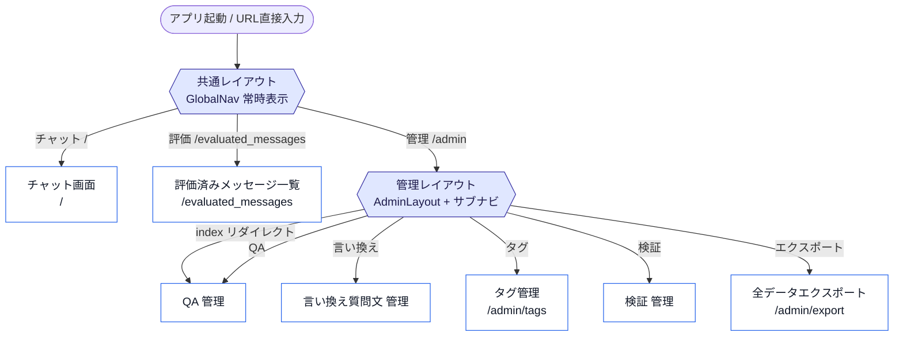

### ルート定義一覧

| # | パス | 画面 | コンポーネント | 種別 |
|---|------|------|----------------|------|
| 1 | `/` | チャット | `StateContainer` | 単一 |
| 2 | `/evaluated_messages` | 評価済みメッセージ一覧 | `EvaluatedMessagesPage` | 単一（読み取り専用） |
| 3 | `/admin`（index） | → `/admin/qa` へリダイレクト | `Navigate` | リダイレクト |
| 4 | `/admin/qa` | QA 一覧 | `QaListPage` | 一覧 |
| 5 | `/admin/qa/new` | QA 新規作成 | `QaFormPage mode="create"` | フォーム |
| 6 | `/admin/qa/:id` | QA 編集 | `QaFormPage mode="edit"` | フォーム |
| 7 | `/admin/hiroba_question_altered` | 言い換え質問文 一覧 | `QuestionAlteredListPage` | 一覧 |
| 8 | `/admin/hiroba_question_altered/new` | 言い換え 新規作成 | `QuestionAlteredFormPage mode="create"` | フォーム |
| 9 | `/admin/hiroba_question_altered/:id` | 言い換え 編集 | `QuestionAlteredFormPage mode="edit"` | フォーム |
| 10 | `/admin/tags` | タグ管理（階層ツリー） | `TagTreePage` | 単一 |
| 11 | `/admin/verification` | 検証質問 一覧 | `VerificationListPage` | 一覧 |
| 12 | `/admin/verification/new` | 検証質問 新規作成 | `VerificationFormPage mode="create"` | フォーム |
| 13 | `/admin/verification/:id` | 検証詳細 | `VerificationDetailPage` | 詳細 |
| 14 | `/admin/verification/:id/edit` | 検証質問 編集 | `VerificationFormPage mode="edit"` | フォーム |
| 15 | `/admin/export` | 全データエクスポート | `ExportPage` | 単一 |

---

## 2. 詳細遷移図（画面間リンク）

一覧 → フォーム／詳細への遷移と「戻る」、および画面をまたぐリンク（言い換え → QA 編集など）を含めた詳細図です。
一覧 → フォームの遷移では検索条件・ページ位置を `back` / URL クエリで保持します（ADR-0068）。

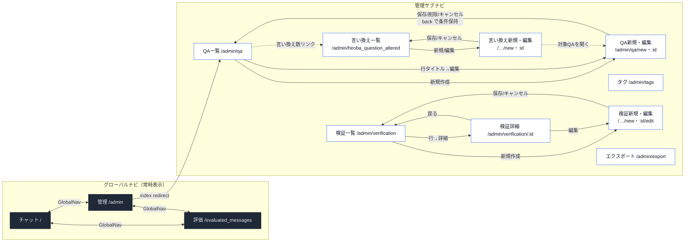

> 凡例: 実線 `→` = ボタン／リンクによる主要遷移、破線 `-.->` = 画面グループをまたぐ補助リンク、
> 双方向 `<->` = グローバルナビによる相互移動。

---

## 3. 画面別スクリーンショット & 説明

### 3.1 チャット画面 `/`

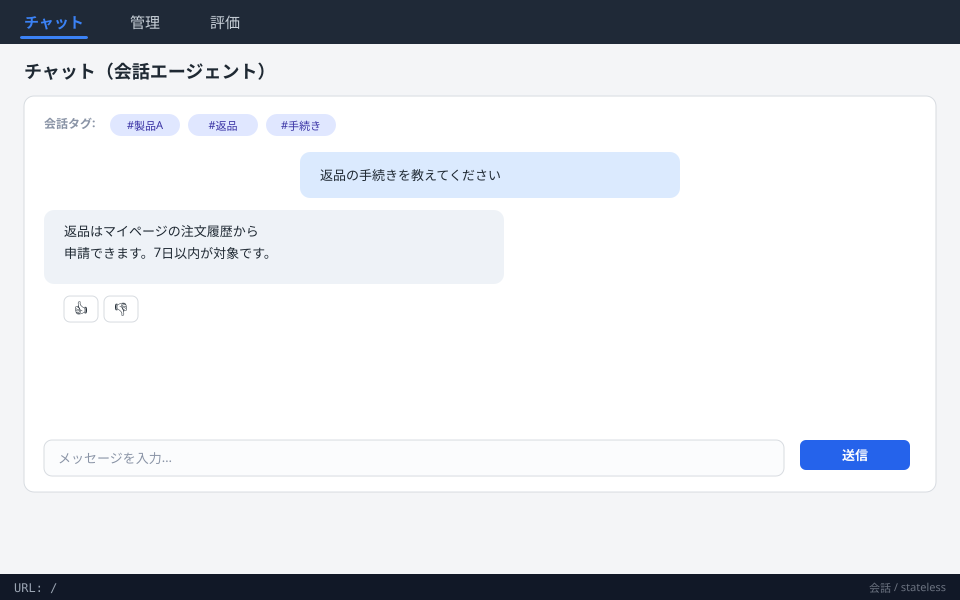

- 会話エージェントとの対話画面（`StateContainer` → `LayoutContainer`）。デフォルト画面。
- ユーザー発話とアシスタント応答をバブル表示。応答には 👍/👎 の評価ボタンを表示（`evaluateResponse`）。
- 会話タグ（`ConversationTag`）をチップ表示。会話は `conversation_id` で継続し、`summary` により要約圧縮。
- 入力バーからメッセージ送信（`askStateless`）。

### 3.2 評価済みメッセージ一覧 `/evaluated_messages`

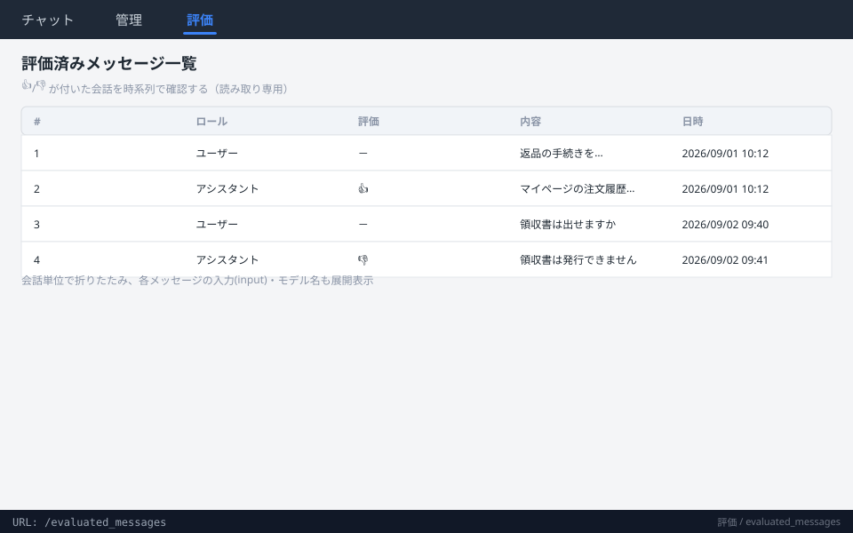

- 👍/👎 が付いた会話・メッセージを時系列で一覧表示（`getEvaluatedMessages`）。**読み取り専用**。
- 会話単位でグルーピングし、各メッセージの内容(content)・入力(input)・モデル名を展開／折りたたみ表示。

### 3.3 QA 一覧 `/admin/qa`

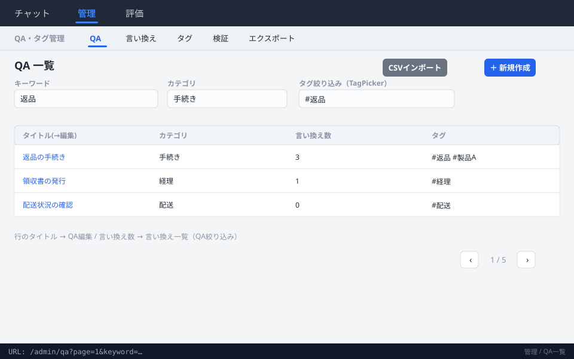

- QA レコードの一覧。キーワード・カテゴリ・タグ（`TagPicker`）で絞り込み、20 件ごとページング。
- 検索条件・ページ位置を URL クエリに保持（`page` / `keyword` 等, ADR-0068）。
- **遷移**: 「新規作成」→ QA 新規、行タイトル → QA 編集（いずれも `back` に現在の検索条件を付与）。
  「言い換え数」列 → 言い換え一覧（当該 QA で絞り込み）。
- CSV インポート（`importQaCsv`）に対応。

### 3.4 QA 新規作成・編集 `/admin/qa/new` ・ `/admin/qa/:id`

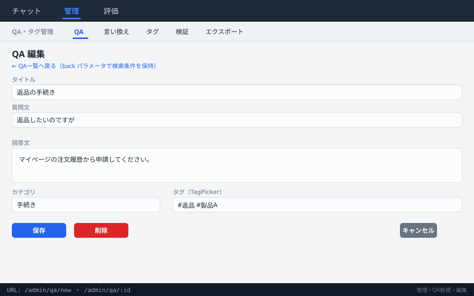

- タイトル・質問文・回答文・カテゴリ・タグ（`TagPicker`）を編集（`createQa` / `updateQa` / `getQa`）。
- 保存・削除・キャンセル後は `back` パラメータ（ホワイトリスト検証済み・オープンリダイレクト対策）で QA 一覧へ戻り、検索条件を復元。

### 3.5 言い換え質問文 一覧 `/admin/hiroba_question_altered`

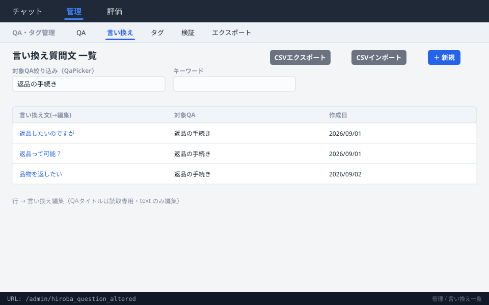

- 言い換え質問文（`is_primary=false`）の一覧（`listQuestionAltered`）。QA 一覧の UI パターンを踏襲。
- 対象 QA（`QaPicker`）・キーワードで絞り込み、ページング。CSV インポート／エクスポート・行単位削除に対応。
- **遷移**: 「新規」→ 言い換え新規、行 → 言い換え編集（`back` で条件保持）。

### 3.6 言い換え 新規作成・編集 `/admin/hiroba_question_altered/new` ・ `/:id`

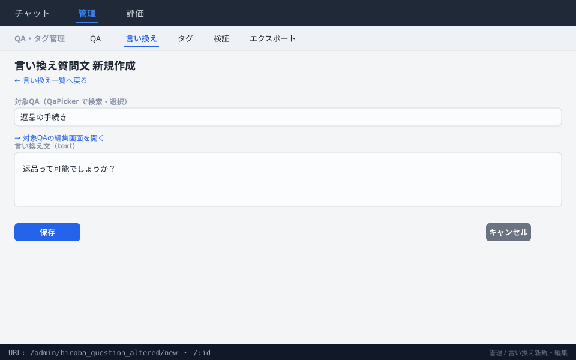

- 新規: `QaPicker` で対象 QA を選び、言い換え文（`text`）を入力。
- 編集: 対象 QA・タイトルは読み取り専用、`text` のみ編集可。
- **補助リンク**: 対象 QA の編集画面（`/admin/qa/:id`）を直接開ける。

### 3.7 タグ管理 `/admin/tags`

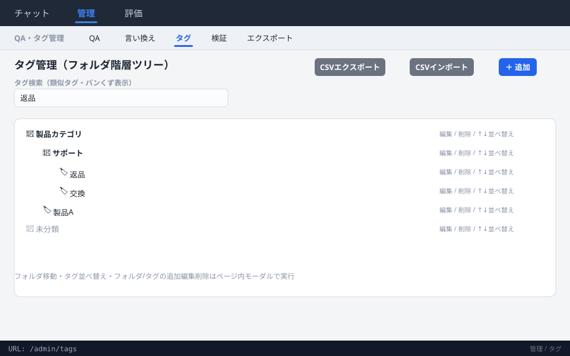

- タグフォルダの階層ツリー表示（`TagTreePage`）。フォルダ・タグの追加／編集／削除、フォルダ移動、並べ替え（`reorder*`）。
- タグ検索（類似タグ検出・パンくず表示）。CSV インポート／エクスポート対応。
- 追加・編集などの操作はページ内モーダルで完結（画面遷移はなし）。

### 3.8 検証質問 一覧 `/admin/verification`

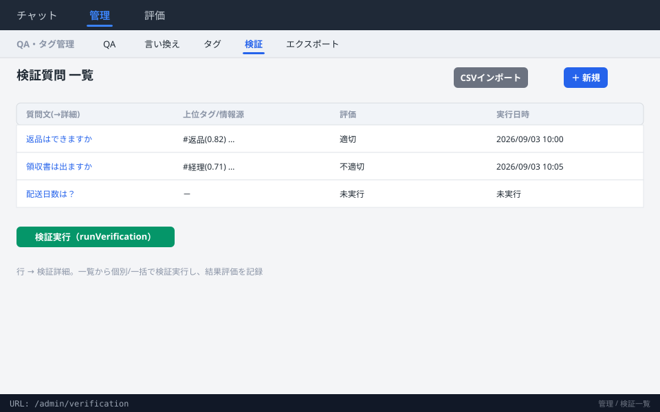

- 検証質問の一覧（`listVerificationQuestions`）。上位タグ／情報源スコア・評価（適切/不適切/未評価）・実行日時を表示。
- 検証実行（`runVerification`）を一覧から起動。CSV インポート対応。
- **遷移**: 「新規」→ 検証新規、行 → 検証詳細。

### 3.9 検証詳細 `/admin/verification/:id`

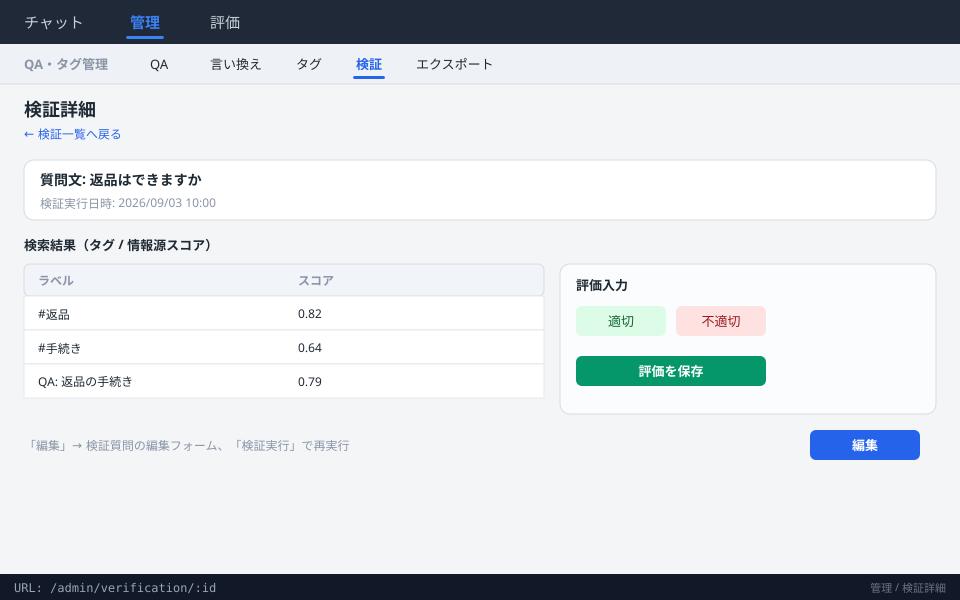

- 1 実行分の検索結果（タグ／情報源スコア）を表示し、評価（適切／不適切）を入力・保存。
- 「検証実行」で再実行、「編集」→ 検証編集フォーム、「戻る」→ 検証一覧。

### 3.10 検証質問 新規作成・編集 `/admin/verification/new` ・ `/:id/edit`

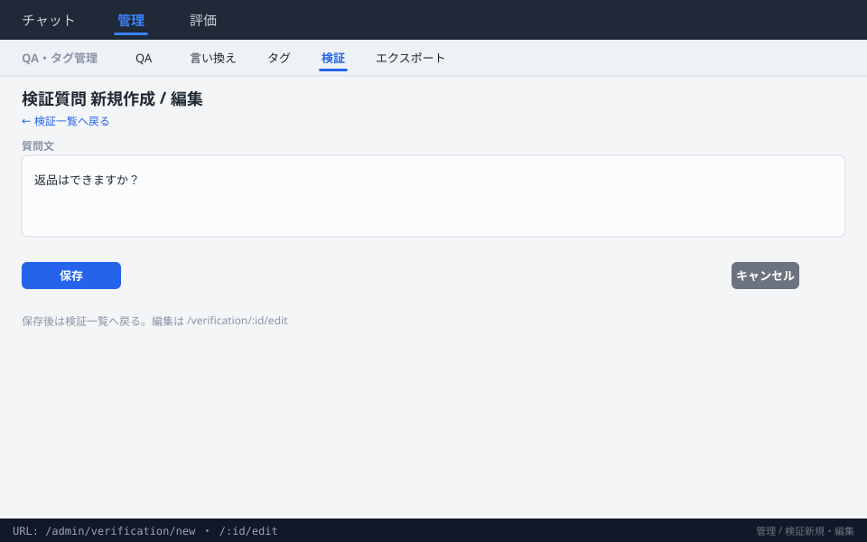

- 検証質問文を入力（`create` / `edit`）。保存後は検証一覧へ戻る。

### 3.11 全データエクスポート `/admin/export`

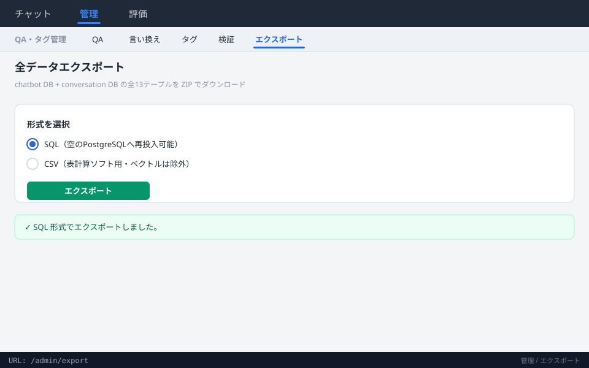

- chatbot DB（7 テーブル）＋ conversation DB（6 テーブル）の全 13 テーブルを ZIP でダウンロード（`downloadExport`）。
- SQL（空の PostgreSQL へ再投入可能）／ CSV（表計算ソフト用・埋め込みベクトル除外）をラジオボタンで選択。
- 処理中はボタン無効化で多重クリック防止、成功／失敗をページ内メッセージ表示。

---

## 4. 補足

- 本図は `front_dev/src/routes.tsx` のルート定義時点の状態に基づきます。ルートを追加・変更した際は本ファイルと
  `screenshots/` の画像もあわせて更新してください。
- グローバルナビ／管理サブナビは各画面共通で表示されるため、どの画面からでも他グループ・他サブ画面へ直接遷移できます
  （上記詳細図では可読性のため一部の共通遷移を省略しています）。
