# 画面遷移図（front_dev / SPA）

chatbot_proto_01 のフロントエンド（`front_dev`, React + react-router-dom による SPA）の画面遷移図です。
Mermaid による遷移図・各画面のスクリーンショット（画像）・補足説明の 3 点構成でまとめています。

- 対象ソース: `front_dev/src/routes.tsx`（ルート定義の唯一の集約点）および各 `feature/**` ページ
- 構成方針: AWS 単一プロセス構成では `web_backend` 側の SPA フォールバック（catch-all）が `index.html` を返すため、
  URL 直接入力・リロードでも本 Router がその path から起動する（ADR-0015 / ADR-0042）
- 画像について: `screenshots/` 配下の画像は全画面とも**実画面のスクリーンショット（PNG）**です。
  撮影・差し替えの手順は [`screenshots/README.md`](./screenshots/README.md) を参照。

---

## 1. 画面グループ全体像

全画面は共通の**グローバルナビ**（`チャット` / `管理` / `評価`）で 3 グループを相互に行き来します。
`管理` グループはさらに 6 つのサブ画面（タグ / 検証 / エクスポート / 広場QA / 広場言い換え / トラブルシューティング）を持ちます。
1 図あたりのノードを絞るため、全体像は「グローバルナビ」→「管理サブナビ」の 2 図に分割しています。

### 1.1 グローバルナビ（3 画面グループ）

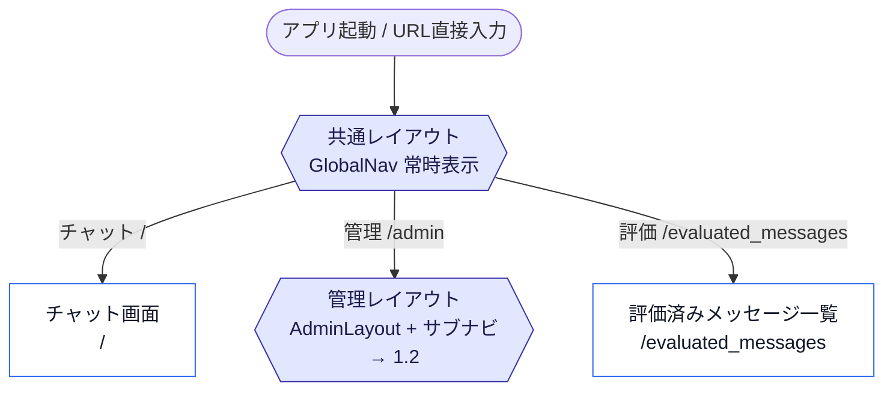
```mermaid
flowchart TD
    Start([アプリ起動 / URL直接入力]) --> Root{{"共通レイアウト<br/>GlobalNav 常時表示"}}

    Root -->|"チャット /"| Chat["チャット画面<br/>/"]
    Root -->|"管理 /admin"| Admin{{"管理レイアウト<br/>AdminLayout + サブナビ<br/>→ 1.2"}}
    Root -->|"評価 /evaluated_messages"| Eval["評価済みメッセージ一覧<br/>/evaluated_messages"]

    classDef group fill:#e0e7ff,stroke:#3730a3,color:#1e1b4b;
    classDef leaf fill:#ffffff,stroke:#2563eb,color:#111827;
    class Root,Admin group;
    class Chat,Eval leaf;
```

### 1.2 管理サブナビ（6 サブ画面）

`/admin` 直下の 6 画面。ナレッジ管理系（広場QA / 広場言い換え / トラブルシューティング）と
横断・運用系（タグ / 検証 / エクスポート）に分かれ、サブナビでいつでも行き来できます。

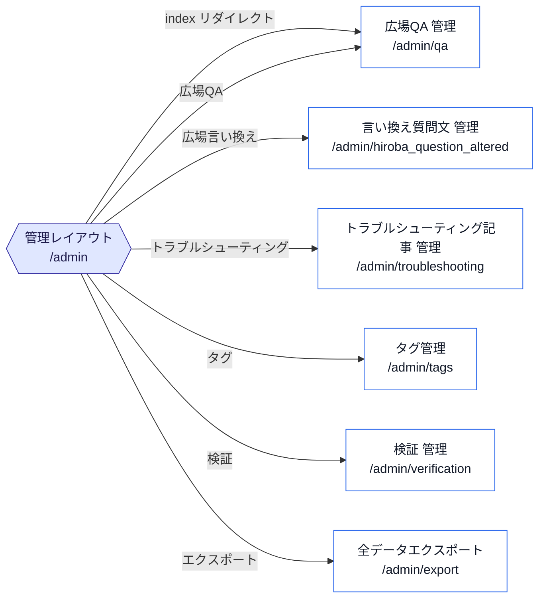
```mermaid
flowchart LR
    Admin{{"管理レイアウト<br/>/admin"}}

    Admin -->|"index リダイレクト"| QA
    Admin -->|"広場QA"| QA["広場QA 管理<br/>/admin/qa"]
    Admin -->|"広場言い換え"| ALT["言い換え質問文 管理<br/>/admin/hiroba_question_altered"]
    Admin -->|"トラブルシューティング"| TS["トラブルシューティング記事 管理<br/>/admin/troubleshooting"]
    Admin -->|"タグ"| TAG["タグ管理<br/>/admin/tags"]
    Admin -->|"検証"| VER["検証 管理<br/>/admin/verification"]
    Admin -->|"エクスポート"| EXP["全データエクスポート<br/>/admin/export"]

    classDef group fill:#e0e7ff,stroke:#3730a3,color:#1e1b4b;
    classDef leaf fill:#ffffff,stroke:#2563eb,color:#111827;
    class Admin group;
    class QA,ALT,TS,TAG,VER,EXP leaf;
```

### ルート定義一覧

| # | パス | 画面 | コンポーネント | 種別 |
|---|------|------|----------------|------|
| 1 | `/` | チャット | `StateContainer` | 単一 |
| 2 | `/evaluated_messages` | 評価済みメッセージ一覧 | `EvaluatedMessagesPage` | 単一（読み取り専用） |
| 3 | `/admin`（index） | → `/admin/qa` へリダイレクト | `Navigate` | リダイレクト |
| 4 | `/admin/qa` | 広場QA 一覧 | `QaListPage` | 一覧 |
| 5 | `/admin/qa/new` | 広場QA 新規作成 | `QaFormPage mode="create"` | フォーム |
| 6 | `/admin/qa/:id` | 広場QA 編集 | `QaFormPage mode="edit"` | フォーム |
| 7 | `/admin/hiroba_question_altered` | 言い換え質問文 一覧 | `QuestionAlteredListPage` | 一覧 |
| 8 | `/admin/hiroba_question_altered/new` | 言い換え 新規作成 | `QuestionAlteredFormPage mode="create"` | フォーム |
| 9 | `/admin/hiroba_question_altered/:id` | 言い換え 編集 | `QuestionAlteredFormPage mode="edit"` | フォーム |
| 10 | `/admin/troubleshooting` | トラブルシューティング記事 一覧 | `TroubleshootingListPage` | 一覧 |
| 11 | `/admin/troubleshooting/:id` | トラブルシューティング記事 編集 | `TroubleshootingFormPage mode="edit"` | フォーム |
| 12 | `/admin/tags` | タグ管理（階層ツリー） | `TagTreePage` | 単一 |
| 13 | `/admin/verification` | 検証質問 一覧 | `VerificationListPage` | 一覧 |
| 14 | `/admin/verification/new` | 検証質問 新規作成 | `VerificationFormPage mode="create"` | フォーム |
| 15 | `/admin/verification/:id` | 検証詳細 | `VerificationDetailPage` | 詳細 |
| 16 | `/admin/verification/:id/edit` | 検証質問 編集 | `VerificationFormPage mode="edit"` | フォーム |
| 17 | `/admin/export` | 全データエクスポート | `ExportPage` | 単一 |

> トラブルシューティング記事は外部情報源からの取り込みが前提のため、**新規作成ルートを持たず編集のみ**です（ADR-0079）。

---

## 2. 詳細遷移図（画面間リンク）

一覧 → フォーム／詳細への遷移と「戻る」、および画面をまたぐリンク（言い換え → 広場QA 編集など）を、
**画面グループごとに 1 図ずつ**に分けて示します。
一覧 → フォームの遷移では検索条件・ページ位置を `back` / URL クエリで保持します（ADR-0068）。

> 凡例: 実線 `→` = ボタン／リンクによる主要遷移、破線 `-.->` = 画面グループをまたぐ補助リンク、
> 双方向 `<->` = グローバルナビによる相互移動。淡色（点線枠）のノードは**他図で詳細を示す画面**です。

### 2.1 グローバルナビの相互移動

どの画面からでもグローバルナビで他グループへ直接移動できます（各グループ内の遷移は 2.2 以降）。

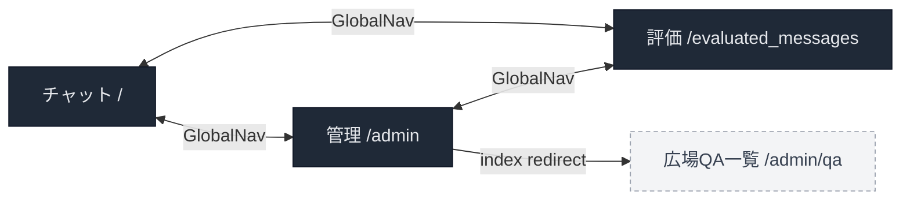
```mermaid
flowchart LR
    Chat["チャット /"]
    AdminHub["管理 /admin"]
    Eval["評価 /evaluated_messages"]
    QAList["広場QA一覧 /admin/qa"]

    Chat <-->|GlobalNav| AdminHub
    AdminHub <-->|GlobalNav| Eval
    Chat <-->|GlobalNav| Eval
    AdminHub -->|index redirect| QAList

    classDef g fill:#1f2937,stroke:#111827,color:#e5e7eb;
    classDef ref fill:#f3f4f6,stroke:#9ca3af,color:#374151,stroke-dasharray:4 3;
    class Chat,Eval,AdminHub g;
    class QAList ref;
```

### 2.2 広場QA（一覧 ⇄ フォーム）

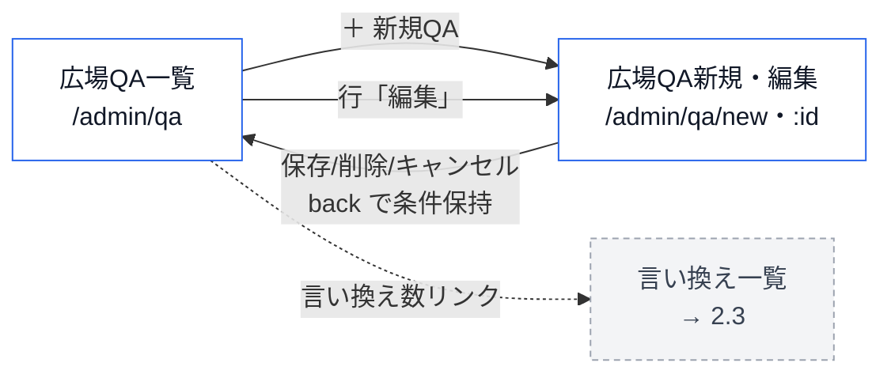
```mermaid
flowchart LR
    QAList["広場QA一覧<br/>/admin/qa"]
    QAForm["広場QA新規・編集<br/>/admin/qa/new・:id"]
    AltList["言い換え一覧<br/>→ 2.3"]

    QAList -->|＋ 新規QA| QAForm
    QAList -->|行「編集」| QAForm
    QAForm -->|保存/削除/キャンセル<br/>back で条件保持| QAList
    QAList -.->|言い換え数リンク| AltList

    classDef a fill:#ffffff,stroke:#2563eb,color:#111827;
    classDef ref fill:#f3f4f6,stroke:#9ca3af,color:#374151,stroke-dasharray:4 3;
    class QAList,QAForm a;
    class AltList ref;
```

### 2.3 言い換え質問文（一覧 ⇄ フォーム）

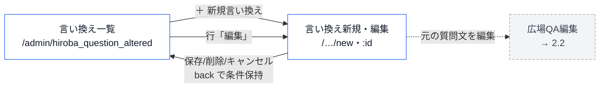
```mermaid
flowchart LR
    AltList["言い換え一覧<br/>/admin/hiroba_question_altered"]
    AltForm["言い換え新規・編集<br/>/…/new・:id"]
    QAForm["広場QA編集<br/>→ 2.2"]

    AltList -->|＋ 新規言い換え| AltForm
    AltList -->|行「編集」| AltForm
    AltForm -->|保存/削除/キャンセル<br/>back で条件保持| AltList
    AltForm -.->|元の質問文を編集| QAForm

    classDef a fill:#ffffff,stroke:#2563eb,color:#111827;
    classDef ref fill:#f3f4f6,stroke:#9ca3af,color:#374151,stroke-dasharray:4 3;
    class AltList,AltForm a;
    class QAForm ref;
```

### 2.4 トラブルシューティング記事（一覧 ⇄ 編集）

新規作成はなく、取り込み済み記事の編集のみです（ADR-0079）。

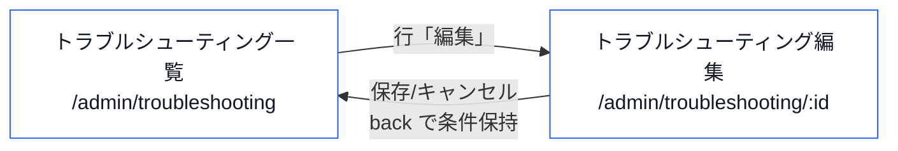
```mermaid
flowchart LR
    TsList["トラブルシューティング一覧<br/>/admin/troubleshooting"]
    TsForm["トラブルシューティング編集<br/>/admin/troubleshooting/:id"]

    TsList -->|行「編集」| TsForm
    TsForm -->|保存/キャンセル<br/>back で条件保持| TsList

    classDef a fill:#ffffff,stroke:#2563eb,color:#111827;
    class TsList,TsForm a;
```

### 2.5 検証（一覧 ⇄ 詳細 ⇄ フォーム）

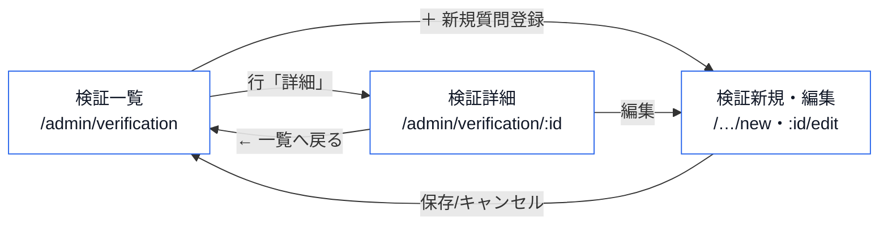
```mermaid
flowchart LR
    VerList["検証一覧<br/>/admin/verification"]
    VerDetail["検証詳細<br/>/admin/verification/:id"]
    VerForm["検証新規・編集<br/>/…/new・:id/edit"]

    VerList -->|＋ 新規質問登録| VerForm
    VerList -->|行「詳細」| VerDetail
    VerDetail -->|編集| VerForm
    VerDetail -->|← 一覧へ戻る| VerList
    VerForm -->|保存/キャンセル| VerList

    classDef a fill:#ffffff,stroke:#2563eb,color:#111827;
    class VerList,VerDetail,VerForm a;
```

### 2.6 遷移を持たない画面

- タグ管理 `/admin/tags`: 追加・編集・並べ替え・削除をすべてページ内で完結（画面遷移なし）。
- 全データエクスポート `/admin/export`: ZIP ダウンロードのみでページ内完結（画面遷移なし）。
- 評価済みメッセージ一覧 `/evaluated_messages`: 読み取り専用（展開／列幅変更のみ、画面遷移なし）。

---

## 3. 画面別スクリーンショット & 説明

### 3.1 チャット画面 `/`

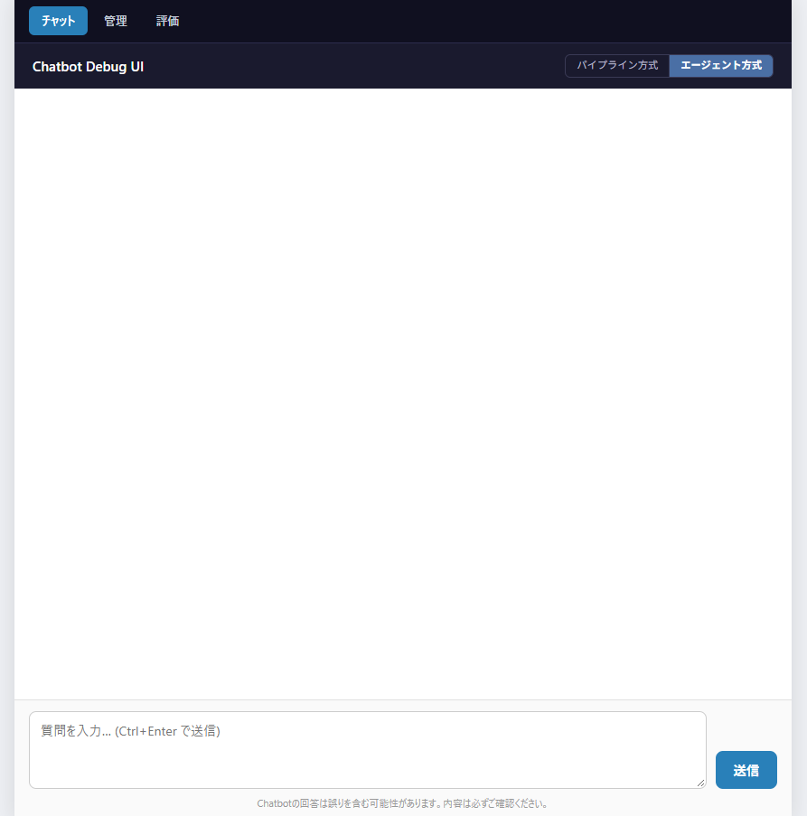

- 会話エージェントとの対話画面（`StateContainer` → `LayoutContainer`）。デフォルト画面。
- ヘッダー右上の**回答生成方式トグル**で `パイプライン方式`（`/api/ask-pipeline`）と
  `エージェント方式`（`/api/ask-agentic`）を切り替える（ADR-0088 / ADR-0089 決定5）。
  選択は localStorage に保存され、リロード後も維持される（既定はパイプライン方式）。
  - パイプライン方式: 言い換え → タグ選定 → 情報源検索1回 → 回答生成の一本道（ADR-0043）。
  - エージェント方式: 検索 → 十分性評価 → クエリ再定式化を最大 2 周回し、見つからなければ逆質問を返す（ADR-0088）。
- ユーザー発話とアシスタント応答をバブル表示。応答には 👍/👎 の評価ボタンを表示（`evaluateResponse`）。
- **評価の理由**（ADR-0099 §4）: 👎 を押すと理由の入力欄が開く（👍 は「理由を書く」で任意に開く）。
  「理由を保存」（または Ctrl+Enter）で評価と一緒に保存し、保存後は「理由: …」と表示する。評価を取り消すと理由も消える。
  応答には回答を生成したリリース（`release_id`）と方式（`ask_mode`）が付き、評価時に一緒に保存される。
- 会話は `conversation_id` で継続し、`summary` により要約圧縮。入力欄から送信（Ctrl+Enter でも送信）。

### 3.2 評価済みメッセージ一覧 `/evaluated_messages`

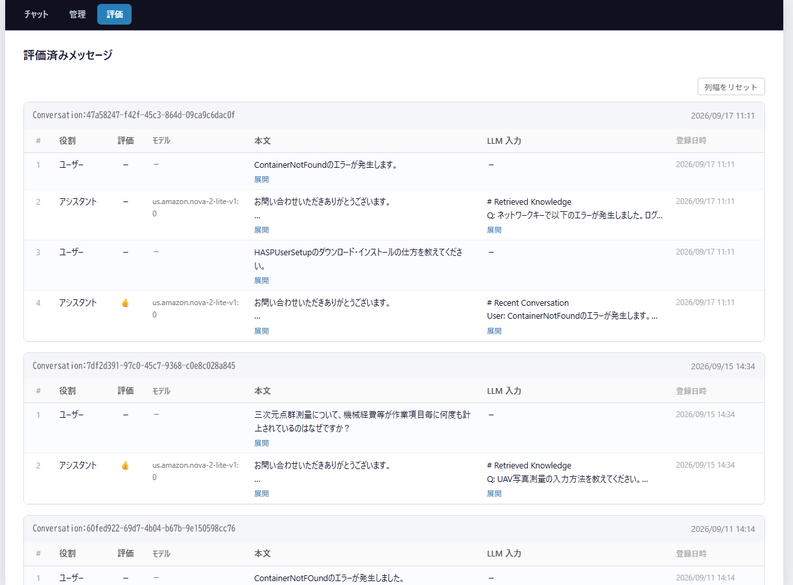

- 👍/👎 が付いた会話・メッセージを会話単位・時系列で一覧表示（`getEvaluatedMessages`）。**読み取り専用**。
- 列は `#` / 役割 / 評価 / 理由 / 方式 / リリース / モデル / 本文 / LLM 入力 / 登録日時。本文と LLM 入力は「展開」で全文表示。
  - 理由・方式・リリースは ADR-0099 で追加。リリース列は `release_id` の先頭8桁で、ホバーすると
    コミット・プロンプトのハッシュ・モデル・設定値を表示する。
- ツールバーの「リリース」で、特定のリリースの回答を含む会話だけに絞り込める（ADR-0099 §4）。
- 列幅はドラッグで調整でき、「列幅をリセット」で初期値へ戻せる（列構成の変更に伴い保存キーは `ev_column_widths_v2`）。
- 同じ評価データは評価ランナー（`evals\eval.bat pull-feedback`）でリポジトリの `evals/feedback/` に取り込める。

### 3.3 広場QA 一覧 `/admin/qa`

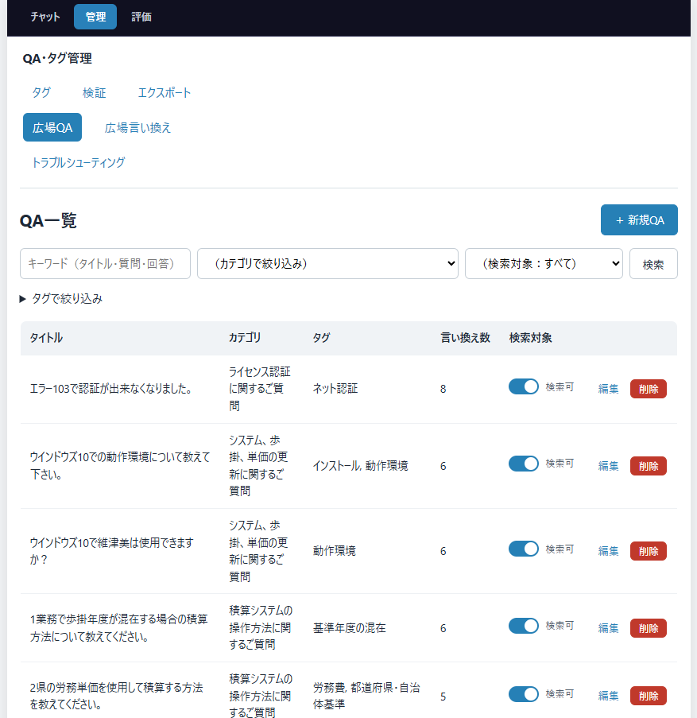

- 広場QA レコードの一覧。キーワード・カテゴリ・**検索対象**・タグ（`TagPicker`）で絞り込み、20 件ごとページング。
- 検索条件・ページ位置を URL クエリに保持（`page` / `keyword` 等, ADR-0068）。
- 列は タイトル / カテゴリ / タグ / 言い換え数 / 検索対象 / 操作（編集・削除）。
- **検索対象トグル**（`is_searchable`, ADR-0092 / ADR-0093）: 一覧では行ごとに即時保存（楽観的更新・失敗時ロールバック）。
  検索不可にした QA は主質問文・言い換え文ともチャットの情報源検索にヒットしなくなる。
- **遷移**: 「＋ 新規QA」→ 広場QA 新規、行の「編集」→ 広場QA 編集（いずれも `back` に現在の検索条件を付与）。
  「言い換え数」列 → 言い換え一覧（当該 QA で絞り込み）。
- 画面下部の折りたたみに CSV 一括インポート／エクスポート（`importQaCsv`）。

### 3.4 広場QA 新規作成・編集 `/admin/qa/new` ・ `/admin/qa/:id`

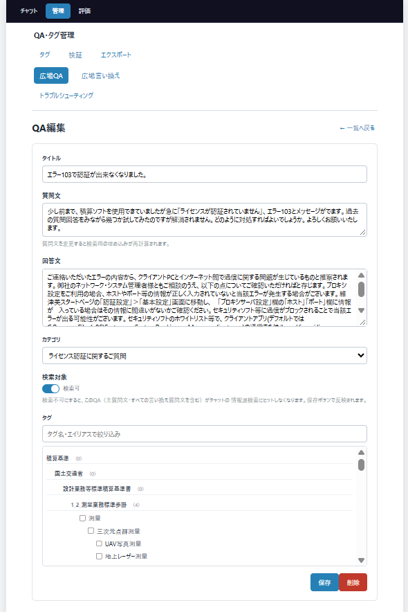

- タイトル・質問文・回答文・カテゴリ・検索対象・タグ（`TagPicker`）を編集（`createQa` / `updateQa` / `getQa`）。
- 質問文を変更すると検索用の埋め込みが再計算される。
- 検索対象トグルはフォーム上では即時保存せず、**保存ボタンで他項目とまとめて反映**（ADR-0093 決定4）。
- 保存・削除・キャンセル後は `back` パラメータ（ホワイトリスト検証済み・オープンリダイレクト対策）で一覧へ戻り、検索条件を復元。

### 3.5 言い換え質問文 一覧 `/admin/hiroba_question_altered`

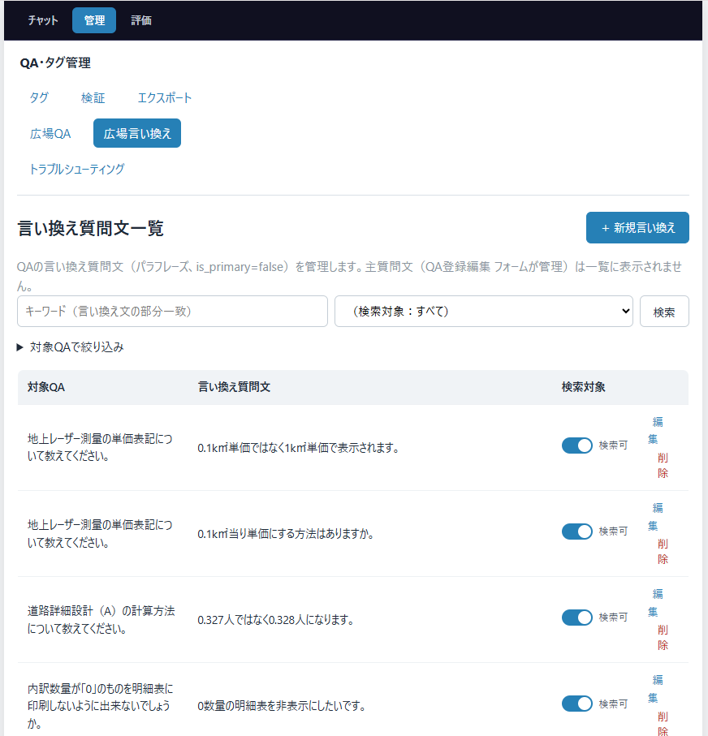

- 言い換え質問文（`is_primary=false`）の一覧（`listQuestionAltered`）。主質問文は本一覧には表示されない（広場QA 登録編集フォームが管理）。
- キーワード・検索対象・対象 QA（`QaPicker`）で絞り込み、ページング。列は 対象QA / 言い換え質問文 / 検索対象 / 操作（編集・削除）。
- 検索対象トグルは一覧では行ごとに即時保存。CSV 一括インポート／エクスポートに対応。
- **遷移**: 「＋ 新規言い換え」→ 言い換え新規、行の「編集」→ 言い換え編集（`back` で条件保持）。

### 3.6 言い換え 新規作成・編集 `/admin/hiroba_question_altered/new` ・ `/:id`

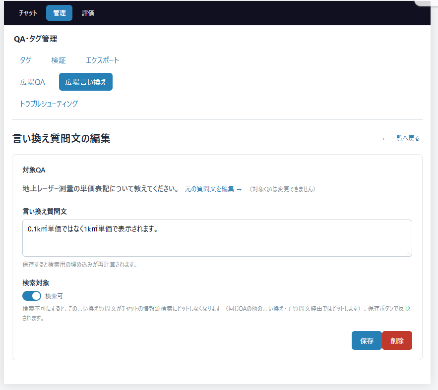

- 新規: `QaPicker` で対象 QA を選び、言い換え文（`text`）を入力。
- 編集: 対象 QA は変更不可。言い換え文と検索対象のみ編集でき、保存すると検索用の埋め込みが再計算される。
- 検索不可にすると当該言い換え文だけがヒットしなくなる（同じ QA の他の言い換え・主質問文経由ではヒットする）。
- **補助リンク**: 「元の質問文を編集 →」で対象 QA の編集画面（`/admin/qa/:id`）を直接開ける。

### 3.7 トラブルシューティング記事 一覧 `/admin/troubleshooting`

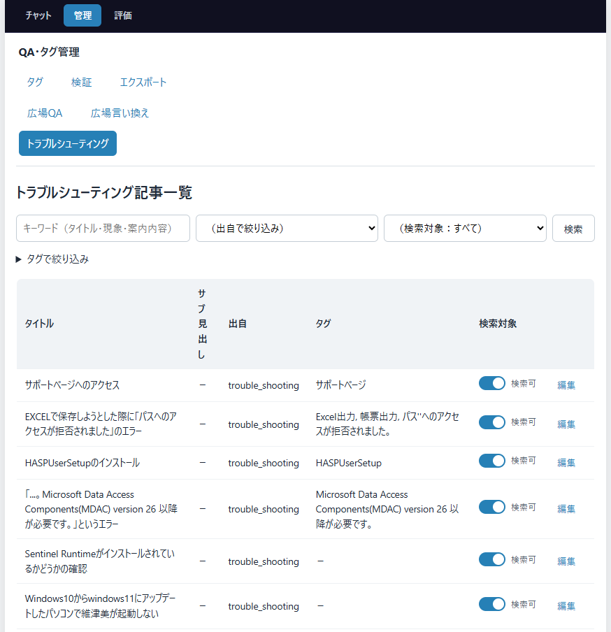

- 外部から取り込んだトラブルシューティング記事の一覧（`listTroubleshootingArticles`）。20 件ごとページング。
- キーワード（タイトル・現象・案内内容）・出自（`source_key`）・検索対象・タグ（`TagPicker`）で絞り込み。
  キーワード・出自・タグ・ページ位置は URL クエリに同期（検索対象フラグは画面内状態のみ, ADR-0093 決定7）。
- 列は タイトル / サブ見出し / 出自 / タグ / 検索対象 / 操作（編集）。検索対象オフの行は淡色表示。
- 検索対象トグルは行ごとに即時保存（1 行あたり同時 1 要求, ADR-0093 決定3）。
  `is_searchable` は埋め込み元フィールドではないため埋め込みの再計算は発生しない（決定2）。
- **遷移**: 行の「編集」→ トラブルシューティング記事編集（`back` で条件保持）。新規作成は初期スコープ外（ADR-0079）。

### 3.8 トラブルシューティング記事 編集 `/admin/troubleshooting/:id`

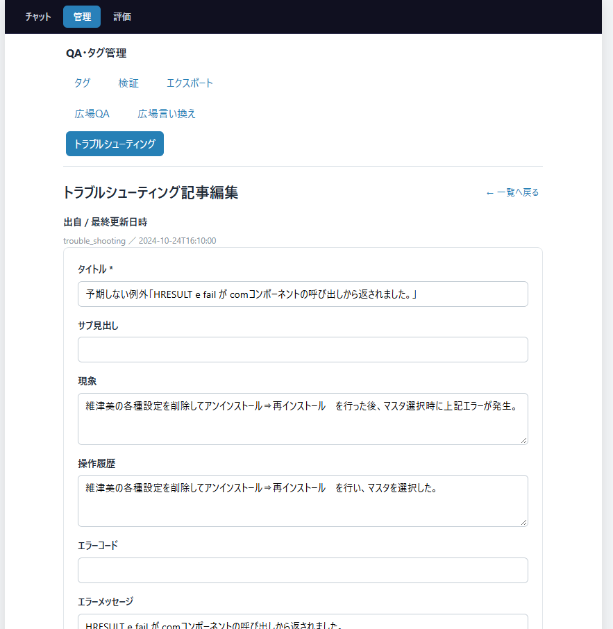

- 出自（`source_key`）と最終更新日時（`source_updated_at`）は取り込み元の情報として読み取り専用で表示。
- 編集項目: タイトル（必須）／サブ見出し／現象／操作履歴／エラーコード／エラーメッセージ／システム環境／
  ハードウェア環境／バージョン情報／ユーザーに案内すべき内容（必須）／原因／備考／キーワード（原文・参考）。
  現象・操作履歴・エラーメッセージ・案内内容・原因・備考は複数行入力。
- タグ（`TagPicker`）と検索対象も編集でき、検索対象は保存ボタンで他項目とまとめて反映（ADR-0093 決定4）。
- 保存・キャンセル後は `back`（ホワイトリスト検証済み）で一覧へ戻る。

### 3.9 タグ管理 `/admin/tags`

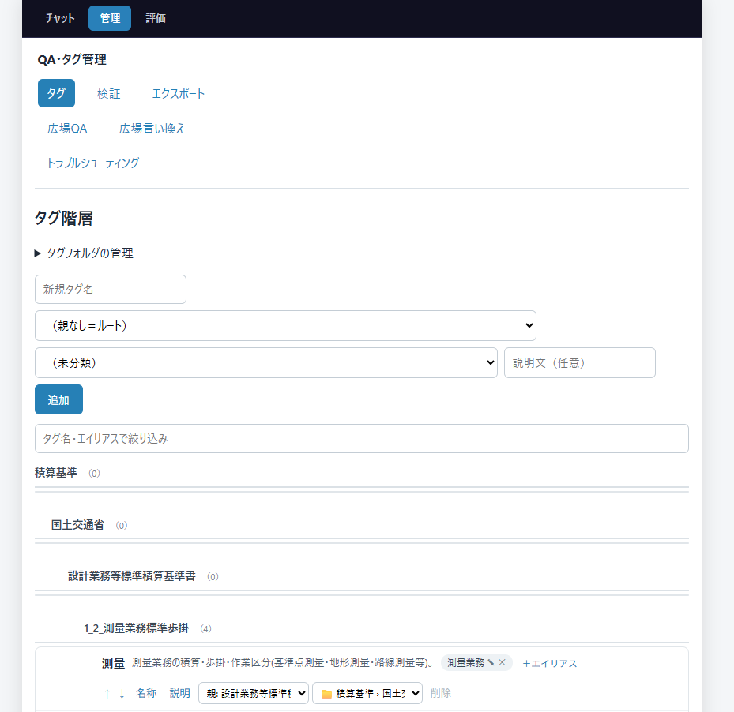

- タグフォルダの階層ツリー表示（`TagTreePage`）。新規タグの追加（親タグ・フォルダ・説明文を指定）、
  タグ名／説明の編集、親タグ・フォルダの変更、並べ替え（↑ ↓, `reorder*`）、削除。
- タグ名・エイリアスでの絞り込み検索、エイリアスの追加。タグ名の右の括弧内は紐づく件数。
- 「タグフォルダの管理」折りたたみからフォルダの追加・編集・削除。CSV インポート／エクスポート対応。
- 追加・編集などの操作はページ内で完結（画面遷移はなし）。

### 3.10 検証質問 一覧 `/admin/verification`

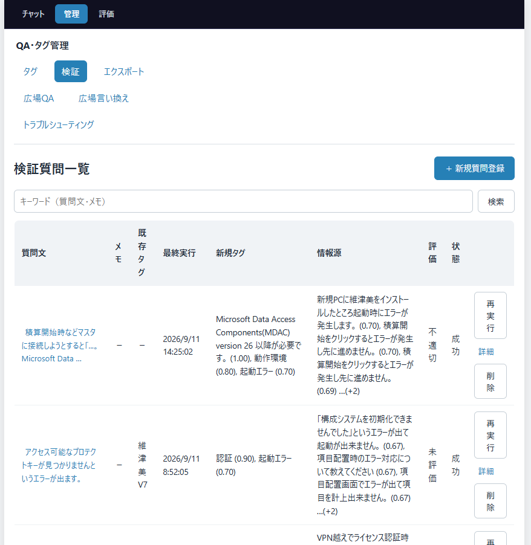

- 検証質問の一覧（`listVerificationQuestions`）。列は 質問文 / メモ / 既存タグ / 最終実行 / 新規タグ /
  情報源 / 評価 / 状態 / 操作（再実行・詳細・削除）。
- 新規タグ・情報源は最新実行のスコア付き上位を表示し、状態は実行の成功／エラーを示す。
- 一覧から「再実行」で検証を実行（`runVerification`）。「削除」は質問と全実行履歴をまとめて削除（確認ダイアログあり）。
- キーワード（質問文・メモ）で絞り込み。画面下部の折りたたみから CSV 一括インポート（常に新規追加・重複判定なし）。
- **遷移**: 「＋ 新規質問登録」→ 検証新規、行の「詳細」→ 検証詳細。

### 3.11 検証詳細 `/admin/verification/:id`

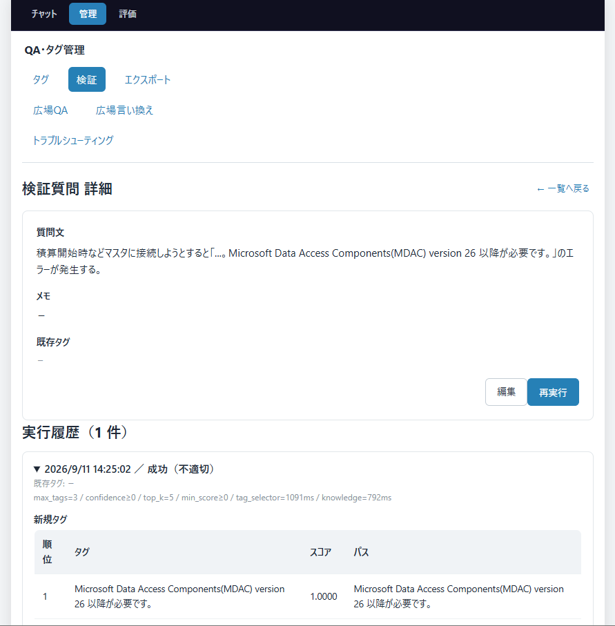

- 上段に質問文・メモ・既存タグを表示し、「編集」→ 検証編集フォーム、「再実行」で検証を再実行（`runVerification`）。
- 下段の「実行履歴（N 件）」は 1 実行ごとの折りたたみ。見出しに実行日時／成功・エラー／評価（適切・不適切・未評価）を並べ、
  実行時のパラメータ（`max_tags` / `confidence` / `top_k` / `min_score` / タグ選定・情報源検索の所要時間）を添えて表示。
- 各実行の「新規タグ」「情報源」を順位・スコア・パス付きの表で確認し、評価（適切／不適切）を入力・保存できる。
- 「← 一覧へ戻る」→ 検証一覧。

### 3.12 検証質問 新規作成・編集 `/admin/verification/new` ・ `/:id/edit`

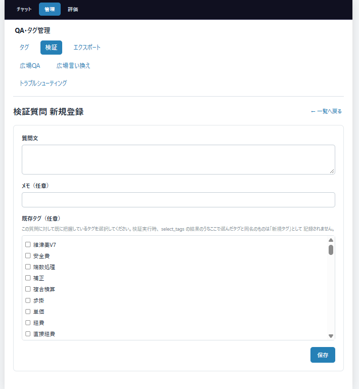

- 質問文・メモ（任意）・既存タグ（任意）を入力（`create` / `edit`）。保存後は検証一覧へ戻る。
- 既存タグはチェックボックスの一覧から選択する。ここで選んだタグと同名のものは、検証実行時に `select_tags` が
  返しても「新規タグ」としては記録されない（既に把握済みのタグを除外するための指定）。
- 「← 一覧へ戻る」で入力を破棄して検証一覧へ戻る。

### 3.13 全データエクスポート `/admin/export`

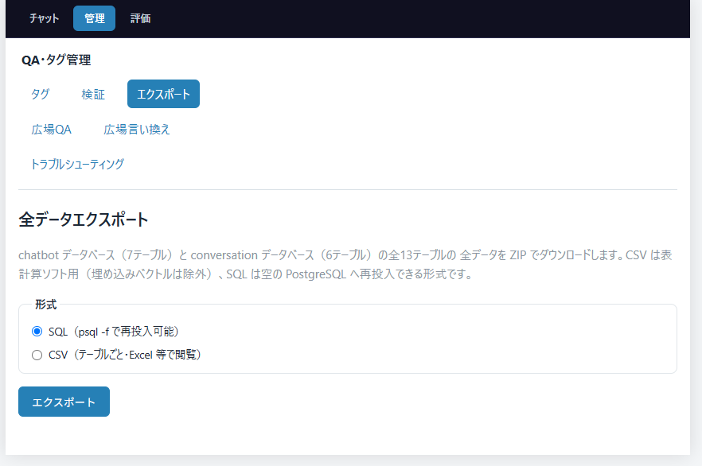

- ナレッジ データベース（9 テーブル）＋ conversation データベース（7 テーブル。ADR-0099 で `release` を追加）の全 16 テーブルを ZIP でダウンロード（`downloadExport`）。
- SQL（`psql -f` で空の PostgreSQL へ再投入可能）／ CSV（テーブルごと・Excel 等で閲覧、埋め込みベクトルは除外）をラジオボタンで選択。
- 処理中はボタン無効化で多重クリック防止、成功／失敗をページ内メッセージ表示。

---

## 4. 補足

- 本図は `front_dev/src/routes.tsx` のルート定義時点の状態に基づきます。ルートを追加・変更した際は本ファイルと
  `screenshots/` の画像もあわせて更新してください。
- グローバルナビ／管理サブナビは各画面共通で表示されるため、どの画面からでも他グループ・他サブ画面へ直接遷移できます
  （2.2 以降の各図では可読性のためグローバルナビ経由の遷移を省略し、2.1 にまとめています）。
- Mermaid の図は原則 1 図あたり 5〜6 ノード程度に収まるよう画面グループ単位で分割しています
  （1.2 のみサブナビ全体の一覧性を優先し、管理レイアウト＋6 サブ画面を 1 図にまとめています）。
  図をまたぐ画面は淡色・点線枠のノードで示し、ラベルに参照先の節番号を記載しています。
- 検索対象フラグ（`is_searchable`）は 広場QA / 言い換え質問文 / トラブルシューティング記事 の 3 系統に共通で、
  一覧では即時保存・フォームでは保存ボタンで反映、という使い分けです（ADR-0092 / ADR-0093）。
